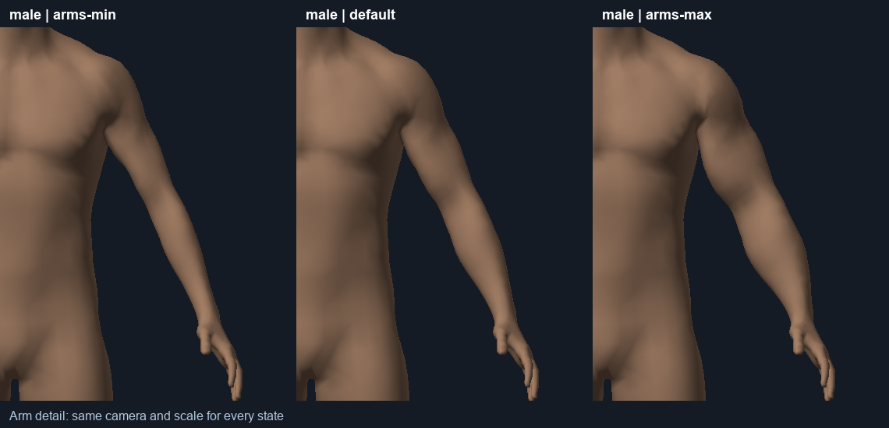
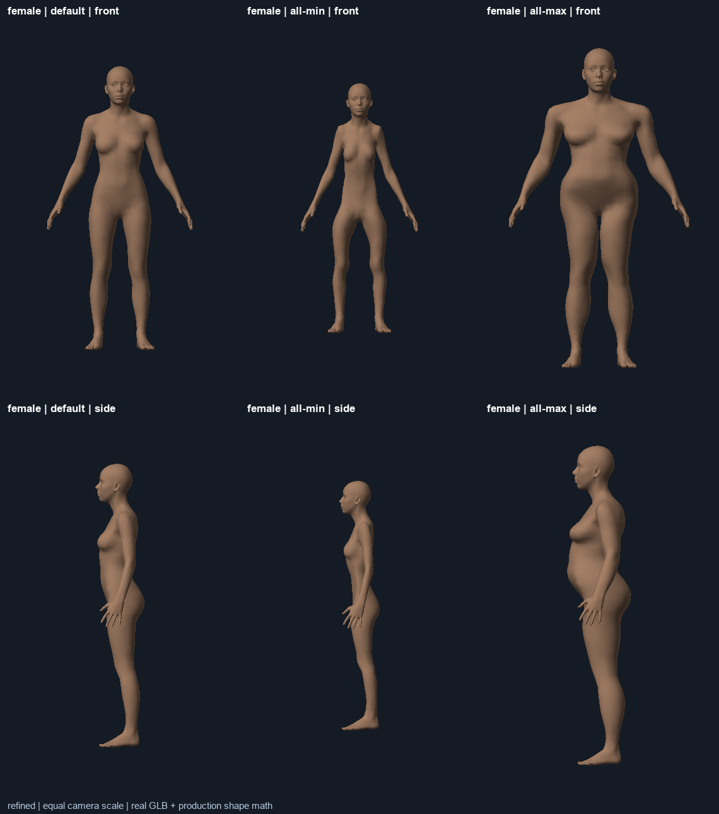
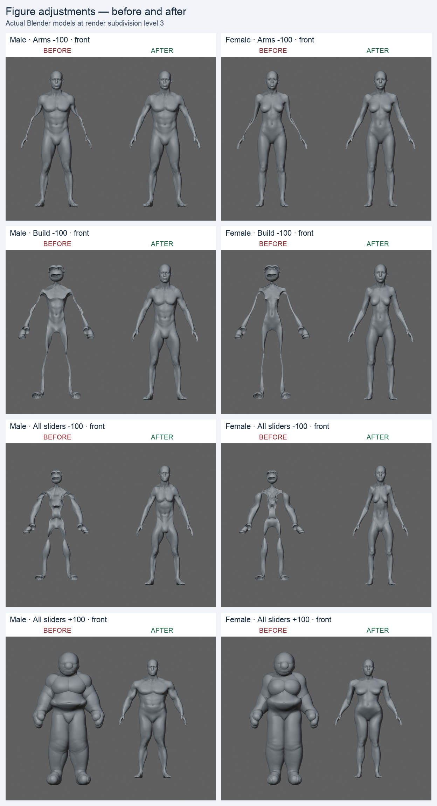

# Figure adjustments

Figure controls now use proportional body deformation with bounded regional growth, instead of moving every surface point by a fixed distance along its normal. The old method could collapse thin limbs and distort fingers and faces.

## Behavior

- Arms grow around centerlines measured from each original figure. Upper arms and forearms blend through elbows and wrists; hands retain their shape.
- Legs use the same approach, with gentler changes at knees and ankles. The inner-thigh transition avoids folding the crotch seam.
- Build adjusts torso and limb fullness while preserving the face, hands and feet.
- A wider chest carries attached arms outward. Shoulder width moves arms with the shoulders.
- Torso adjustments scale width/depth; belly changes blend over the front rather than following noisy surface normals.
- Head size changes are limited to 6% each way, with a neck transition. Height is limited to 8% each way. Leg length adds/subtracts at most 3.5% of original figure height, keeping the feet grounded before the viewer recenters the figure.
- Combined Build/local adjustments have radial limits: arms 0.78–1.32, legs 0.80–1.30, torso scale 0.80–1.28. These are local deformation factors before height scaling and transitions, not circumference measurements.
- Sliders and the right-click wheel share clamping. Values show relative adjustment strength, from −100 to +100; zero is the original shape. Each slider explains its effect. Clicking its value or double-clicking the slider resets it; Escape or an interrupted radial gesture restores its starting values.
- Saved scenes retain their values and use the new interpretation. Original model assets and tattoo placement sizing are unchanged.

## Verification

- 200 real-mesh scenarios across male/female, including every control endpoint, presets, opposing settings, and seeded extreme/random combinations. Tested the actual expanded triangle geometry used by the editor. No reversed relative triangle normals or faces collapsed below 5% of their original area in these cases. This diagnostic is not a general proof against all possible self-intersections.
- Exact reset, non-accumulating edits, seam coincidence, preserved detailed extremities, and visible upper-arm/forearm thickness changes.
- Visual review of every endpoint, presets, opposing combinations, front/side silhouettes and arm closeups using the actual meshes and production deformation.
- 31 cases per body compare TypeScript and Python against every GLB vertex: identical Float32 positions. Native Blender cage checks also match. 28 native Blender renders checked the subdivided surfaces, front and side.
- Optimization retained bit-identical positions and normals across all 72 visual fixtures. On this machine, full editor geometry deformation measured about 6 ms median / 8 ms 95th percentile; rendering and UI overhead are additional.
- Both final 512×640 exports through the running Blender server returned valid PNGs: male athletic in 14.53 seconds and female combined maximum in 9.03 seconds. Images were opened and checked for body form; server health returned ready afterward.
- TypeScript, lint, production build, demo regression suite, body-shape suite and backend tests passed.
- Browser automation remains unavailable because its admin policy check could not be verified. Live browser clicking/shader inspection was not performed. Visual evidence comes from offline geometry rendering and native Blender.

## Reproduce

```sh
npm run test:shape
npm run test:demo
npm run typecheck
npm run lint
npm run build
# Requires Python with NumPy and Pillow:
BODY_SHAPE_PYTHON=/path/to/python node tools/body-shape-visual.mjs --stage current --all-renders
# Optional actual Blender mesh parity:
/Applications/Blender.app/Contents/MacOS/Blender -b -t 2 --python tools/body-shape-parity-blender.py -- --assets smartink-live --output reports/body-shape/blender
node tools/body-shape-parity.test.mjs --blender-report reports/body-shape/blender
```

Generated detailed reports belong under ignored `reports/body-shape/`. The representative images below are retained for review.






