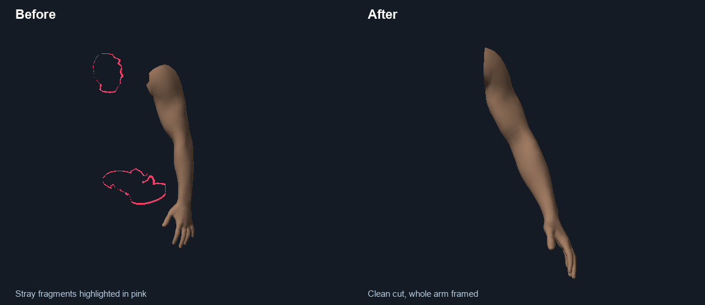

# Focus and smooth views

Focus now shows only the selected body part, with a smooth cut boundary. It
includes the entire hand or foot and fits the visible surface with a 15% margin.
The fit also accounts for bent poses, body shape, camera direction and narrow
windows. **Fit focused part** recenters it after zooming, orbiting or posing.

Focus preserves the side being viewed and levels the camera at the part's
height. The limb retains its natural pose. Front, Back, Side and other camera
presets also fit the current figure or focused part; Close Up and Wide retain
their intended zoom differences.

Camera changes ease over 560 ms. They travel around the figure, avoiding the
straight path through its center when switching Front/Back. Clicking another
view midway continues from the current camera position. Dragging, scrolling or
starting tattoo placement stops the transition immediately. Reduced-motion
preferences disable the animation, and reopening a scene restores its saved
camera immediately.

## What caused the stray mesh

The old shader interpolated region numbers. A triangle joining torso (0) and
right arm (3) could therefore contain pixels labeled head (1) or left arm (2).
That produced the detached strips visible in the reported screenshot.

Each region now has a signed field on the original skin. The shader, picking
and camera use the same zero boundary. The torso/arm separation is measured
from each figure, so the female figure does not inherit the male separator.
Smooth fields replace stair-stepped vertex labels at the cut. Positions, UVs,
triangle order, tattoo anchors, body shape and pose data are preserved.

Blender uses the same original field as a transparent material cut. Its mesh
topology and multires detail remain intact, and hidden skin cannot emit body
hair. Exported shots use the actual current camera, including during a transition.

## Verification

- `npm run test:focus` checks actual male/female meshes, signed-field browser/
  Blender parity, complete hands, duplicate UV seams, phantom-piece regressions,
  cut-edge bounds and actual Workspace camera-request wiring.
- Production camera component tests cover eased paths, Front/Back and poles,
  rapid switching, pointer/wheel interruption, modifier locks, reduced motion,
  initial saved views, snapshots, damping restoration and no save feedback loop.
- `node tools/focus-visual.mjs --stage final --audit-only` checks 1,764 complete
  region fits across both figures, poses and shape extremes, seven directions,
  and portrait/landscape windows. Every visible boundary point stays within
  the padded viewport. Offline comparisons were inspected visually.
- Native Blender verification passed 18 cutout renders, two complete cinematic
  exports and 36 pose/Focus checks. Hidden skin, stray hair and photographic
  focus were checked. A real `/render-v2` focused-arm request also returned a
  complete PNG successfully; the image was inspected and the server remains ready.
- The full existing placement, save, export, shape and pose regression suite
  remains part of `npm run test:demo`.

The browser's security check was unavailable during this pass, so interactive
browser verification could not run. The comparison below is an offline render
of the actual geometry, masks and camera; pink highlights the old stray pieces.

