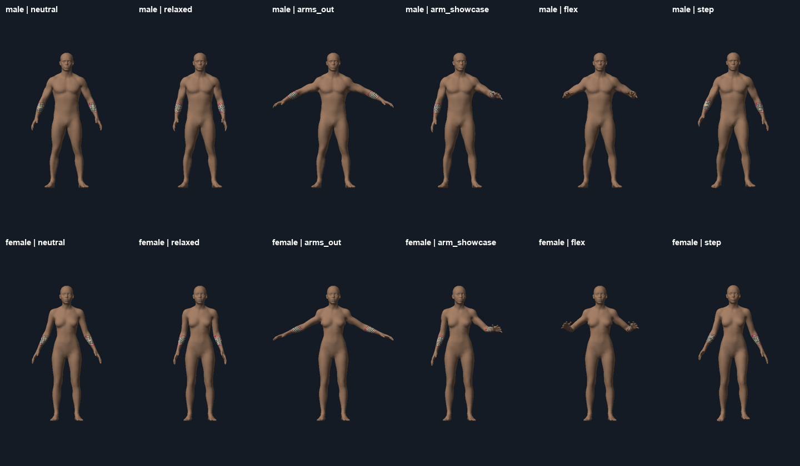
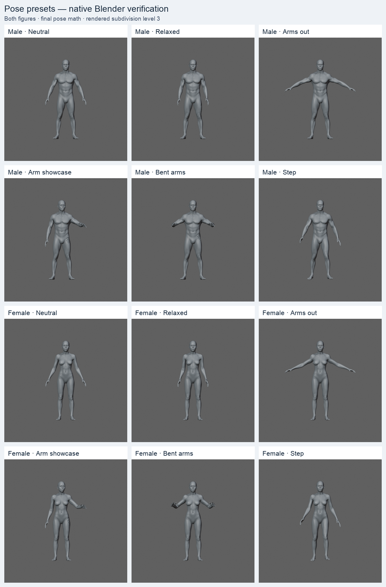

# Poses and limb controls

Open **Pose** in the figure panel. Choose Neutral, Relaxed, Arms out, Arm showcase,
Bent arms or Step. Open **Adjust limbs** for individual controls. Left and right
refer to the figure's own sides. **Move both arms/legs together** mirrors the
selected limb when enabled, then edits both sides together. Selecting a preset
turns linking off so asymmetric presets remain easy to edit.

Click an angle value, or double-click its slider, to reset that joint. **Reset
pose** returns the whole figure to neutral without changing the body shape or
tattoo. **Frame pose** fits the current figure or isolated body part in the view.
Poses save with scenes and are included in Blender renders and live sync.

## Movement limits

Angles are relative to the original stance, in degrees.

| Control | Range |
| --- | --- |
| Arm lift | −10 to 40 |
| Arm forward | −10 to 35 |
| Elbow bend | 0 to 85 |
| Leg spread | −5 to 15 |
| Leg forward | −15 to 30 |
| Knee bend | 0 to 55 |
| Head turn | −35 to 35 |
| Head tilt | −15 to 15 |

Shoulder and elbow limits adapt to the existing angles. Forward movement plus
elbow bend is capped at 100°. Lowering an arm also reduces its forward range:
at −10° lift, forward movement stops at 25°. The slider being edited stops at its
limit; it does not unexpectedly change another joint.

## Implementation

The supplied figures have no skeleton. A bounded procedural joint rig measures
pivots and each model's torso/arm gap from the original mesh, applies body shape,
then poses the shaped mesh. Limb rotations blend around joints while hands,
feet and the upper head stay rigid. Each update starts from the original mesh
so repeated edits never accumulate deformation.

Triangle order, UVs, original region labels and tattoo anchors remain unchanged.
Tangent frames rotate with the skin and welded normals are refreshed. Blender
uses the same pose math after its body shape step. Region cuts retain their
original membership; head accessories follow the head and hair uses original
skin weights. Explicit saved angles override a preset label, and older scenes
default to neutral. The old `arm_extended` ID maps to Arms out.

This is bounded static posing for the two shipped figures. It does not include
animation, dragging joints in the viewport, wrist/finger articulation, a foot
plant solver or general collision avoidance. Some compression near a strongly
bent joint remains possible; keep tattoo presentation away from extreme folds.

## Verification

- `npm run test:demo`: existing placement, shape, saving and export checks, plus
  190 real-mesh pose cases covering both figures, all control endpoints, presets,
  combined body shapes, seeded combinations, transitions and discovered regressions.
- Geometry checks cover finite positions, triangle collapse, edge stretching,
  seam equality, rigid hands/feet/head, unchanged UV anchors, rotated tangents,
  exact reset and non-accumulating repeated edits.
- Production control tests cover separate and linked edits, adaptive bounds,
  presets, resetting, framing, migration, saving and outbound contracts.
- Browser/Blender math parity: 43 pose/shape cases per body × 12,010 GLB vertices,
  with identical Float32 positions and original region labels.
- `npm run test:pose-server`: malformed/out-of-range pose contracts rejected
  before rendering. The existing render server tests also remain applicable.
- Native Blender: 18 pose cases match browser positions exactly; 36 region cuts
  retain original skin membership. Head accessories remain attached.
- Two real `/render-v2` requests succeeded for male Arms out and a female custom
  step. The running server reports ready after restart; both PNGs were inspected.
- `tools/body-pose-visual.mjs` renders the actual editor geometry with diagnostic
  tattoo grids from front, side and back for visual inspection. These are offline
  geometry renders, not screenshots of the browser's shader or controls.

Interactive browser automation was unavailable during this pass. Geometry
images, native Blender renders and production control/state tests were used;
the final browser layout still needs a manual look in the running app.

## Visual evidence

